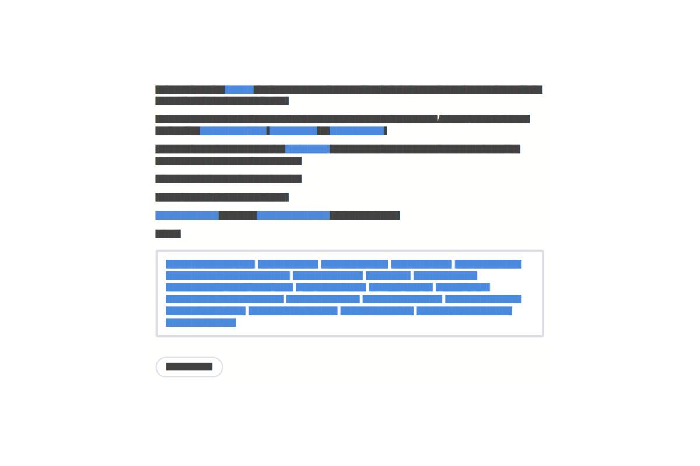

# Fediverse Signatures



Collect signatures for an article on your blog or a website page.

## Supported platforms

- Mastodon
- Friendica
- Pleroma
- Akkoma
- Misskey
- Calckey
- Sharkey
- Firefish

## Add to your website

Please see the included `example.html` file for a full example of the code needed to add a fediverse signature feature to a web page.

Here's a breakdown of the steps:

1. Add a link to `https://signatures.stefanbohacek.dev/signatures?url=ENCODED_CURRENT_PAGE_URL`. Here's how such a URL can be created dynamically with JavaScript.

```js
const currentPageUrl = encodeURIComponent(window.location.origin + window.location.pathname);
const signatureURL = `https://signatures.stefanbohacek.dev/signatures?url=${currentPageUrl}`;
```

2. Make an AJAX request to `https://signatures.stefanbohacek.dev/signatures?url=ENCODED_CURRENT_PAGE_URL&format=json` to request the list of accounts who signed your page.

```json
{
  "page_url": "https://stefanbohacek.com/blog/a-fediverse-invitation-for-artists/",
  "signatures": [
    {
      "account": "stefan",
      "server": "stefanbohacek.online",
      "account_clean": "stefan",
      "server_clean": "stefanbohacek.online",
      "url": "https://stefanbohacek.online/@stefan"
    }
 ]
}
```

Note that `account_clean` and `server_clean` are filtered for any potential profanities.

## Development

Note that this project relies on my personal hosted copy of the [auth-server](https://github.com/stefanbohacek/auth-server) project. If you're interested in self-hosting, [please reach out](https://stefanbohacek.com/contact/) for more details.

```sh
npm install
npm run dev
```
